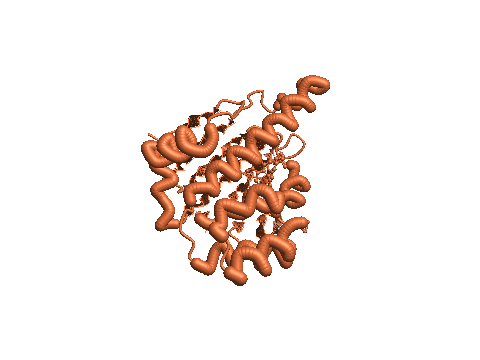
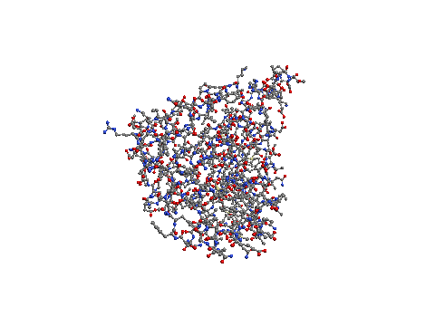
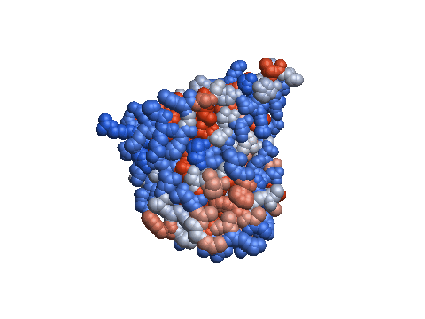
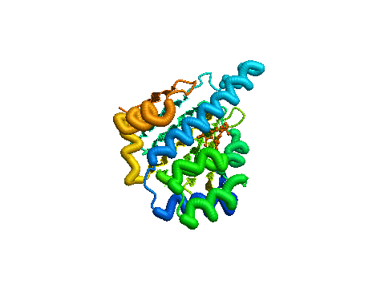

# TermPDB

**A 3D molecular structure viewer that lives in your terminal.**

TermPDB loads PDB and mmCIF macromolecular structures — from local files, gzip
archives, or directly by RCSB entry ID — and renders them with a custom
software rasterizer using truecolor ANSI half-blocks. No GPU, no graphics
stack: just a terminal with 24-bit color support.

```text
termpdb 1crn            # fetch and view crambin straight from RCSB
termpdb structure.cif.gz --mode ribbon --color plddt
termpdb 4egk.pdb -m vdw -s --spin-speed 1.5
```

## Demo (PDB 4EGK: Human Topoisomerase I - DNA Complex)

| Cartoon Ribbon (pLDDT Confidence) | Ball & Stick (CPK Elements) |
|:---:|:---:|
|  |  |
| **Space-Filling VDW (Hydrophobicity)** | **Cartoon Ribbon (N→C Rainbow)** |
|  |  |

## Features

**Representations** — backbone/CA trace, ball & stick, cartoon ribbon
(Catmull-Rom splines with helix/sheet shaping), van der Waals space-filling,
and a Unicode-Braille subpixel wireframe.

**Coloring** — CPK elements, N→C rainbow, per-chain, secondary structure,
B-factor, AlphaFold pLDDT confidence, Kyte-Doolittle hydrophobicity,
electrostatic potential, plus Catppuccin / Nord / Tokyo Night / Gruvbox themes.

**Lighting & post-processing** — Blinn-Phong shading, screen-space ambient
occlusion (pocket shadowing), silhouette depth outlines, and depth-of-field
focal cueing — all computed on the CPU per frame.

**Scientific tooling**
- DSSP secondary-structure assignment (Kabsch-Sander H-bond energies)
- Kabsch superposition with RMSD (`--align`, SVD-based with reflection handling)
- Biological assembly expansion from `REMARK 350` / `pdbx_struct_oper_list`
- Non-covalent interaction display: hydrogen bonds & disulfide bridges
- Distance / bond-angle / dihedral measurements with Ramachandran regions

**Headless export** — ANSI text frames, Kitty Graphics escape sequences,
supersampled PNG, vector SVG, standalone animated GIF (pure Rust), and turntable MP4 video, all scriptable
for pipelines.

## Build

Requires a Rust toolchain (2024 edition, e.g. via [rustup]).

```sh
cargo build --release
./target/release/termpdb --help
```

[rustup]: https://rustup.rs

> **Note:** `.cargo/config.toml` builds with `-C target-cpu=native` to let LLVM
> auto-vectorize the hot rasterizer loops. The resulting binary is tuned for
> the build machine and may fail with `SIGILL` on older CPUs. For portable
> binaries, build with `RUSTFLAGS=""` or delete that file.

## Usage

```
termpdb <FILES> [OPTIONS]
```

`FILES` accepts `.pdb` / `.cif` / `.ent` (optionally `.gz`), or a 4-character
RCSB ID such as `1crn` (fetched over the network).

Common options:

| Flag | Effect |
|---|---|
| `-m, --mode <MODE>` | `trace` · `ball-and-stick` · `ribbon` · `vdw` · `wireframe` |
| `-c, --color <SCHEME>` | `cpk` · `rainbow` · `chain` · `ss` · `bfactor` · `plddt` · `hydrophobicity` · `charge` · `catppuccin` · `nord` · `tokyo-night` · `gruvbox` |
| `-s, --spin` / `--spin-speed <F>` | turntable auto-spin |
| `--kitty` | render using high-resolution Kitty Graphics Protocol |
| `--model <N>` | show model N of a multi-model file |
| `--assembly <ID>` | render biological assembly ID (`asu` for the asymmetric unit) |
| `--interactions` | draw H-bonds and disulfide bridges |
| `--dof <DIST>` | depth-of-field focal distance |
| `--dist A,B` | print Å-distance between two atoms and exit |
| `--angle A,B,C` / `--dihedral A,B,C,D` | print planar/torsion angle and exit |
| `--align FILE...` | Kabsch-superimpose extra structures, report RMSD |
| `--dssp` | force DSSP recalculation |
| `--export-ansi -` | write an ANSI frame to stdout and exit |
| `--export-kitty out.kitty` | write Kitty graphics escape sequence to file or stdout (`-`) and exit |
| `--export-png out.png --width 1920 --height 1080 --ssaa 3` | supersampled image |
| `--export-svg out.svg` | vector output |
| `--export-gif out.gif --frames 60 --fps 30` | animated 3D turntable GIF (pure Rust, no ffmpeg) |
| `--export-mp4 out.mp4 --frames 90 --fps 30` | spinning turntable video (requires ffmpeg) |
| `--lod auto\|full\|backbone\|ca` | level-of-detail for huge complexes |

Atom selectors are `CHAIN:RESSEQ[:ATOM]` — e.g.
`--dist A:12:CA,A:40:N` or `--dihedral A:7:N,A:7:CA,A:7:C,A:8:N`.

### Interactive controls

| Keys | Action |
|---|---|
| `1`–`5` / `m`·`M` | representation mode / cycle modes |
| `c`·`C` | cycle color schemes |
| `K` / `g` | toggle Kitty graphics protocol / half-block mode |
| left-drag / arrows | orbit camera |
| right-drag / WASD | pan |
| scroll / `[` `]` | zoom |
| `Space`, `+`/`-` | toggle spin, adjust speed |
| `/` then `A:12:CA` | pick atom by selector (click also picks) |
| `x` | clear selection — 2 atoms show distance, 3 show angle, 4 show dihedral/Ramachandran region |
| `n`/`p` | next/previous model |
| `b`/`B` | next/previous biological assembly |
| `l`/`L` | cycle level of detail |
| `o` / `u` | toggle waters / hydrogens |
| `e` / `k` / `O` / `f` | interactions / SSAO / outlines / depth-of-field |
| `i`, `?`, `r`, `q` | info modal, help modal, reset camera, quit |

## Architecture

```
src/
├── parser/    PDB + mmCIF readers, gzip, RCSB fetcher
├── model/     Structure/Chain/Residue/Atom, bonds, spatial grid,
│              assemblies, DSSP, alignment, interactions
├── math/      Vec3/Mat4/quaternion, splines, Kabsch
├── render/    framebuffer, z-buffered software rasterizer, lighting,
│              post-processing, Braille canvas, PNG/SVG/MP4 export
├── select/    atom selectors, picking, measurement reports
└── tui/       ratatui event loop, app state, widgets
```

The renderer is a CPU rasterizer: analytic sphere/cylinder intersections into a
linear-view-space Z-buffer, banded across cores with rayon. Per-frame cost is
kept low by caching camera-independent data (per-atom colors, ribbon geometry,
detected interactions) and re-rasterizing only when the scene changes.

## Development

```sh
cargo test        # ~200 integration tests, no network required
cargo clippy --all-targets
cargo fmt
```

Design history and the feature roadmap live in [`ROADMAP.md`](ROADMAP.md) and
[`docs/superpowers/`](docs/superpowers/).

## License

MIT — see [LICENSE](LICENSE).
